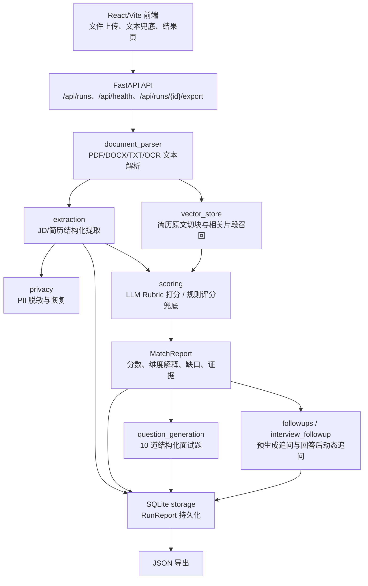

# AI 招聘演示系统

本地演示版 AI 招聘筛选系统：上传 JD 和 1-20 份 PDF/DOCX/TXT 简历，生成结构化简历档案、匹配评分、匹配依据与待确认点、面试题、追问问题和 JSON 报告。

演示用的样本简历放在 `samples/resumes/`，可直接通过前端上传体验。

## 功能

- FastAPI 后端，React/Vite 前端。
- PDF/DOCX/TXT 文档解析，JD 与简历文本兜底输入。
- 图片型 PDF 简历在 macOS 本地演示环境会自动使用系统 Vision OCR 兜底解析。
- SQLite 保存运行报告，本地 Chroma/Hashing 向量索引保存证据片段。
- OpenAI-compatible LLM 可选；没有 `LLM_API_KEY` 时自动使用本地规则兜底。
- 外部 LLM 调用前会脱敏候选人姓名、电话、邮箱和微信号。

## 核心流程

系统围绕 Scenario A「简历解析与试题生成」组织成四个可解释步骤。

1. **结构化提取**：上传或粘贴 JD 与简历后，后端先解析 PDF/DOCX/TXT 文本，再抽取 `JDProfile`、`CandidateProfile` 和带原文证据的 `ExtractedFact`。配置了 LLM 时优先使用 LLM 做语义抽取；LLM 不可用、输出无效或缺少证据时，自动回退到本地规则抽取。候选人个人信息在外部 LLM 调用前会先脱敏。
2. **智能匹配打分**：系统用 JD 的技能、职责和岗位名检索当前候选人简历原文中的相关片段，同时把结构化 facts 直接送入评分上下文。LLM 可用时先根据 JD facts 生成动态 Rubric，再逐项判断候选人是否匹配；失败时回退到本地六维评分器。两条路径都输出同一个 `MatchReport`。
3. **试题生成**：当候选人匹配分达到材料质量阈值后，系统基于 JD、候选人档案、简历 facts 和 `MatchReport` 生成 10 道面试题。LLM Prompt 约束题目结构、题型比例和评分标准；LLM 不可用或输出不合规时，使用本地规则题库兜底。
4. **追问模拟**：系统提供两层追问。一层是在运行报告中预生成 3-5 条追问，主要来自简历模糊点和匹配缺口；另一层是面试官输入候选人回答后，通过 `/api/runs/{run_id}/answer-followup` 生成针对当前回答的动态追问。动态追问同样有规则兜底。

流程图 PDF：

- [结构化提取流程](assets/structured_extraction_flow.pdf)
- [智能匹配打分流程](assets/scoring_flow.pdf)
- [试题生成流程](assets/question-generation-flow%201.pdf)
- [追问生成流程](assets/followup-flow%201.pdf)

## 架构图与数据流



模块划分：

- `backend/app/main.py`：API 入口，负责文件收集、运行记录查询、JSON 导出和回答后追问接口。
- `backend/app/pipeline.py`：主编排入口，串联抽取、向量片段召回、评分、试题生成、追问和持久化。
- `backend/app/extraction/`：JD 与简历结构化提取，包括 LLM 抽取和本地规则兜底。
- `backend/app/scoring/`：LLM 动态 Rubric 评分与本地规则评分。
- `backend/app/question_generation/`：面试题生成，优先 LLM，失败回退规则题库。
- `backend/app/followups/` 与 `backend/app/interview_followup/`：报告预生成追问和候选人回答后的动态追问。
- `backend/app/vector_store.py`：把简历原文切块后做相关片段召回，作为评分解释证据。
- `backend/app/storage.py`：SQLite 保存完整 `RunReport`。
- `frontend/src/App.tsx`：单页操作台，展示总览、结构化提取、匹配打分、试题生成和追问模拟。

## Prompt 设计思路

Prompt 的核心目标不是让模型自由发挥，而是让它在可校验的数据合约里产出稳定结果。

1. **严格 JSON 合约**：所有 LLM Prompt 都要求只返回 JSON 对象，后端再通过 Pydantic schema 和解析器校验。无效输出不会继续污染流程，而是触发本地兜底。
2. **证据优先，减少幻觉**：JD 与简历抽取都要求每条事实绑定原文 evidence；匹配 Prompt 只能引用输入中的 `evidence_indexes`；没有证据时不能给强匹配或直接匹配。
3. **动态 Rubric 而不是固定模板**：`rubric_generation.md` 要求模型根据本次 JD facts 生成总分 100 的 Rubric，下游会归一化权重，避免所有岗位都套同一套评分维度。
4. **输出可控**：试题生成固定 10 道题，并约束技术/业务题、HR 题和简历中心题的比例；回答后追问只生成一个最有价值的追问，避免一次性输出过多问题。

关键 Prompt 文件：

- `backend/prompts/extraction/jd_requirements.md`：从 JD 原文抽取岗位名称、关键要求、证据和重要性。
- `backend/prompts/extraction/resume_profile.md`：从简历原文抽取候选人档案和 evidence-backed facts。
- `backend/prompts/matching/rubric_generation.md`：根据 JD facts 生成动态评分 Rubric。
- `backend/prompts/matching/requirement_matching.md`：逐条判断候选人是否覆盖 Rubric requirement。
- `backend/prompts/question_generation/interview_questions.md`：生成 10 道有考察点和评分标准的面试题。
- `backend/prompts/interview_followup/answer_diagnosis.md`：诊断候选人回答质量并生成下一条追问。

## 难点与解决方案

1. **文档解析不稳定**：真实简历可能是 PDF、DOCX、TXT，也可能是图片型 PDF。解决方案是统一入口解析文本：PDF 优先读取文字层，空文本时在 macOS 演示环境走 Vision OCR；DOCX 使用 `python-docx`；文本文件尝试多种编码。解析失败时把错误记录为 warning，仍允许用户使用文本兜底输入。
2. **LLM 输出格式不稳定**：模型可能返回字段缺失、类型不一致、证据不足或不满足数量约束的 JSON。解决方案是 Prompt 先约束输出，再用 schema normalization、Pydantic 校验和业务 parser 做二次防线；不合规时不硬吞结果，直接回退到本地规则。
3. **评分需要可解释而不是黑盒分数**：单纯让 LLM 给总分很难说明为什么。解决方案是先抽取 JD facts 和简历 facts，再生成动态 Rubric，匹配时必须绑定 evidence；同时保留简历原文片段召回，最终 `MatchReport` 展示分数、维度解释、匹配理由、缺口理由和证据片段。
4. **演示环境不能强依赖外部服务**：评审或本地运行时可能没有 API key，Chroma 也可能初始化失败。解决方案是所有关键步骤都有本地兜底：LLM 不可用时走规则流程；Chroma 不可用时使用 hashing embedding 和内存相似度检索；`.env.example` 只保留占位 key，避免泄露真实凭证。

## 启动

首次安装依赖：

```bash
make install
```

演示启动：

```bash
make demo
```

打开 `http://localhost:5173`。

查看服务状态：

```bash
make status
```

也可以分开启动：

```bash
make backend
make frontend
```

`make dev` 和 `make demo` 都会同时启动前端和后端；`demo` 是给演示场景准备的更直观别名。

## 可选 LLM 配置

复制 `.env.example` 后设置：

```bash
export LLM_BASE_URL="https://api.openai.com/v1"
export LLM_API_KEY="..."
export LLM_MODEL="gpt-4o-mini"
```

DeepSeek 等兼容 OpenAI Chat Completions 的网关也可以使用相同变量。

## 验证

```bash
make test
cd frontend && npm run build
```
